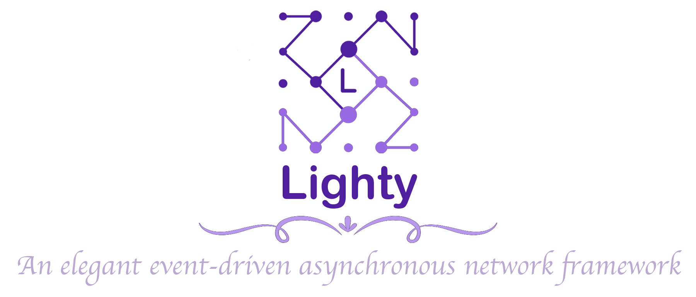

[](https://opensource.org/licenses/MIT)
[](https://maven-badges.herokuapp.com/maven-central/io.github.light0x00/lighty-all)
[](https://openjdk.java.net/)

<p align="center">
    
</p>

中文 | [English](./README.en.md)

## 📖介绍

Lighty 是一个以「优雅」贯穿始终的, 异步非阻塞的, 基于事件驱动的网络框架. 追求「内部结构」与「用户界面」的 「优雅」 是 Lighty 设计过程中的第一要义.

使用 Lighty, 你会感受到它的 “极简”、“逻辑自洽”、“边界感”, 以及 “灵性”, 而非丑陋的机械感, 这种丑陋盛行于许多流行的技术中.

它的最初设计灵感源于 Doug Lea 的 《Scalable I/O in Java》, 对并发控制的理论支持也基本源于 Doug Lea 起草的 JSR133, JEP188 相关文档. 同样地, Lighty 也受启发于 Netty, 毫无疑问, Netty 的很多设计都是网络框架的最优解.

Lighty 基于 Multiple Reactors 模式实现, 并具有如下特性:

- **100% lock-less**, 基于线程栈封闭、组件间异步通信、线程绑定等手段, Lighty 中的 I/O 的处理全流程无锁.
- **Pipeline**, 基于对象行为型模式, 带来极强的扩展性.
- **线程池分离**, 支持 Event-Loop 与 Pipeline 使用各自独立的线程池, 且可以 1 对 1 指定 Pipeline 中每个环节的执行线程.
- **负载均衡**, Channel 会以特定的负载策略分配给 Reactors.
- **缓冲池**, 支持缓冲区回收复用, 减少内存开销.
- **RingBuffer**, 采用双指针, 使用更便利.
- **Zero Copy**, 支持零拷贝文件分发.

## 📝开始

```xml
<dependency>
 <groupId>io.github.light0x00</groupId>
 <artifactId>lighty-all</artifactId>
 <version>0.0.1</version>
</dependency>
```

我们将编写一个 Hello World 服务, 它会打印接受到消息, 并回复 `"Hello World"`.

如果以自顶向下的方式解决这个问题, 那么我们可以先实现写上层处理逻辑, 在这个层面我们处理的是 `String`类型 的输入/输出. 而底层, 则是编码/解码层.

```txt
            ┌─────────────────────┐
 layer 3    │   MessageHandler    │
            └─────────────────────┘
                  ▲          │
                  │          ▼
            ┌────────┐  ┌─────────┐
 layer 2    │Decoder │  │ Encoder │
            └────────┘  └─────────┘
                  ▲          │
                  │          ▼
            ┌─────────────────────┐
 layer 1    │       Reactor       │
            └─────────────────────┘
```

我们先编写一个 `HelloWorldHandler` 它位于上图中的 layer 3.

```java
class HelloWorldHandler extends InboundChannelHandlerAdapter { //1.
  @Override
  public void onRead(@Nonnull ChannelContext context, @Nonnull Object data, @Nonnull InboundPipeline pipeline) { //2.
    //3.
    var msg = (String) data;
    System.out.println("Received:" + msg);
    //4.
    String reply = "Hello World";
    context.writeAndFlush(reply)
        //5.
        .addListener(future -> context.close());
  }
}
```

1. 继承 `InboundChannelHandlerAdapter`.
2. 重写 `onRead` 方法, 处理“入方向”的数据.
3. 将消息转换为 `String`, 并打印到控制台.
4. 回复 `String` 消息.
5. 发送完成后, 关闭 channel.

接下来, 我们要实现 layer 2, 幸运地是 Lighty 中内置了对文本的编码/解码器, 因此只需要将其加入 Pipeline 即可.

```java
public class HelloWorldServer {
    public static void main(String[] args) {
        //1.
        NioEventLoopGroup group = new NioEventLoopGroup(1);
        //2.
        new ServerBootstrap()
                //3.
                .group(group)
                //4.
                .childInitializer(channel -> {
                    channel.pipeline().add(
                            new StringEncoder(StandardCharsets.UTF_8), //4.1
                            new StringDecoder(StandardCharsets.UTF_8), //4.2
                            new HelloWorldHandler());  //4.3
                })
                //5.
                .bind(new InetSocketAddress(9000));
    }
}
```

1. 创建一个事件循环组, 指定线程数为 1, 这意味着我们有 1 个 Reactor 来负责处理 channel 的事件
2. 创建一个 Server.
3. 指定事件循环组.
4. 配置 Pipeline, 并指定字符串码/解码器.
5. 指定监听端口

至此, 我们便完成了一个能接收 UTF-8 编码的文本, 并且会回复 “Hello World” 的服务. 你可以使用 telnet 进行调试, 也可以继续了解如何使用 Lighty 编客户端的实现.(见下文) 

## 📑 后记

如果你想了解更多 Lighty 的使用案例, 可以阅读 [Lighty 最佳实践](./doc/best-practices/index.md).

如果你想了解关于 Lighty 的内部设计, 可以阅读 [深入理解 Lighty](doc/deep-dive-into-lighty/index.md) .