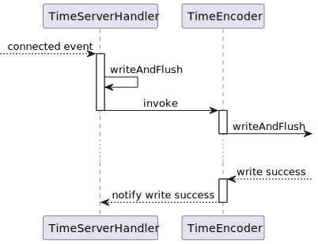
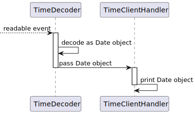

中文 | [English](./index.en.md)

# Lighty 最佳实践

```xml
<dependency>
	<groupId>io.github.light0x00</groupId>
	<artifactId>lighty-all</artifactId>
	<version>0.0.1</version>
</dependency>
```

## 编写一个 Echo 服务

一个 Echo 服务所要做的事, 即满足 “所发即所得”.  首先我们需要编写一个 `ChannelHandler`, 实现 Server 的处理逻辑.

```java
class EchoHandler extends InboundChannelHandlerAdapter { //1.
    @Override
    public void onRead(@Nonnull ChannelContext context, @Nonnull Object data, @Nonnull InboundPipeline pipeline) {
        context.write(data);  //2.
        context.flush(); //3.
    }
}
```

1. 继承 `InboundChannelHandlerAdapter` 并重写 `onRead()`, 以处理到来的数据.
2. 调用 `ChannelContext.write()` 写入数据, 这里我们将收到的数据原封不动地发回.
3. 调用 `ChannelContext.flush()` 使得写入的数据被实际地发出.
    > 你也可以直接调用 `ChannelContext.writeAndFlush()`, 这样便可以省去第 4 步.
    
下一步, 我们启动一个 Server, 并使用 `EchoHandler` 来处理连接.

```java
public class EchoServer {
    public static void main(String[] args) {
        // 1. create an event-loop group, being used to handle to nio event and executing the handler's tasks.
        NioEventLoopGroup eventLoopGroup = new NioEventLoopGroup(1, new IdentifierThreadFactory("server"));

        // 2. Create a server builder
        new ServerBootstrap()
                //3. Specify the event-loop group
                .group(eventLoopGroup)
                //4. Specify an initializer for Configuring the accepted channel.
                .childInitializer(new ChannelInitializer<>() {
                    @Override
                    public void initChannel(@Nonnull InitializingNioSocketChannel channel) {
                        //4.1 Configure the pipeline for accepted channel
                        channel.pipeline().add(new EchoHandler());
                    }
                })
                //5. Bind an address
                .bind(new InetSocketAddress(9000));
    }
}
```

1. 创建 `NioEventLoopGroup` 对象, 并指定线程数为 1, 这表示创建的 Server 只有一个单线程 `EventLoop` 来处理事件.
2. 创建 `ServerBootstrap` 对象, 用于构建 Server.
3. 指定使用第 1 步创建的 `eventLoopGroup` 来处理连接.
4. 指定一个 `ChannelInitializer` 对象, 来初始化新到来的连接, 这里我们将 `EchoHandler` 加入 pipeline, 作为连接的处理逻辑.
5. 绑定一个地址, 就如同使用 java socket 标准库时需要做的一样.

现在, 一个 Server 服务已经编写完成, 运行后, 你可以使用 `telnet` 工具调试.

## 编写一个报时服务

一个报时服务的职责是, 每当由连接建立, 发送当前时间给客户端.

如下代码中, 我们在 `onConnected` 事件中, 写入一个 `Date` 对象, 并在写完的异步回调中关闭连接.

```java
class TimeServerHandler extends ChannelHandlerAdapter {
   @Override
   public void onConnected(@Nonnull ChannelContext context) {
      //1.
      context.writeAndFlush(new Date())
              //2.
              .addListener(future -> {
                 context.close();
              });
   }
}
```

但这里有一个问题是, Lighty 并不知道 `Date` 对象该如何编码为字节, 因此我们还需要提供一个 `TimeEncoder` 负责序列化工作.

```java
class TimeEncoder extends OutboundChannelHandlerAdapter {
        @Override
        public void onWrite(@Nonnull ChannelContext context, @Nonnull Object data, @Nonnull OutboundPipeline pipeline) {
            //1.
            var date = (Date) data;

            //2.
            RecyclableBuffer buf = context.allocateBuffer(8);
            buf.putLong(date.getTime());

            //3.
            pipeline.next(buf)
                    //4.
                    .addListener(future -> {
                        System.out.println("success:" + future.isSuccess());
                    })
                    //5.
                    .addListener(pipeline.upstreamFuture());
                
        }
    }
```

1. 接收 pipeline 的上游传来的 `Date` 对象.
2. 分配一块缓冲区用于存储编码后的字节序列. 因为我们传输的是毫秒为单位的时间戳, 所以这里分配了 8 字节.
3. 调用 `pipeline.next()` 将存储字节的缓冲区传输到下游.
4. 监听下游的写入结果.
5. 将下游的写入结果通知到上游.

至此, 报时服务的核心业务逻辑便编写完成, 最后一步是创建一个 Server, 并将 `TimeServerHandler`, `TimeEncoder` 加入 pipeline 中, 如下:

```java
public class TimeServer {
    public static void main(String[] args) {
        NioEventLoopGroup group = new NioEventLoopGroup(1);

        new ServerBootstrap()
                .group(group)
                .childInitializer(channel -> 
                        //配置 pipeline
                        channel.pipeline().add(new TimeServerHandler(), new TimeEncoder()))
                .bind(new InetSocketAddress(9000));
    }
}
```

看到这里, 你也许会好奇 “上游” 与 “下游” 是如何确定的? 提出这个问题,这是了解 Lighty 的一个很好的开始.
在 `TimeServer` 的代码中, 我们指定了一个 `ChannelInitializer`, 用于初始化 channel 相关的配置, 其中包括 pipeline. 

如果我们如下方式配置 pipeline:

```java
channel.pipeline().add(new TimeServerHandler(), new TimeEncoder()))
```

那么将得到的输出管道如下:



`TimeServerHandler` 输出的数据, 被传递给 `TimeEncoder` 编码, 之后继续传递, 最后由 Lighty 接收, 并负责写入 socket send buffer.  在这个过程中,`TimeServerHandler` 是 `TimeEncoder` 的上游. 

上下游之间的通信是可能异步的( 如果你指定了单独的线程 group ), 互相通过 `ListenableFutureTask` 进行通信, `TimeEncoder` 第 5 步把写入结果通知给了上游的 `TimeServerHandler`, 使得上游的 `FutureListener` 得以触发.

## 编写报时服务客户端

一个报时服务的客户端, 所需要做的事情是, 连接服务端, 并打印收到的时间.

```java
class TimeClientHandler extends InboundChannelHandlerAdapter {
   @Override
   public void onRead(@Nonnull ChannelContext context, @Nonnull Object data, @Nonnull InboundPipeline pipeline) {
      var d = (Date) data;
   
      System.out.println("Time is " + d);
   }
}
```

`TimeClientHandler` 假设了其接收的是 `Date` 对象, 但是, Lighty 不知道读出的字节应该如何解码.
因此我们还需要编写一个 `TimeDecoder`. 

以异步事件驱动的方式去解码是一件有些麻烦的事, 但好在 Lighty 提供简化这一过程的辅助类 `ByteToMessageDecoder`.

```java
class TimeDecoder extends ByteToMessageDecoder { //1.
    public TimeDecoder() {
        super(8); //1.
    }

    @Override
    protected void decode(ChannelContext context, RingBuffer buffer, InboundPipeline pipeline) {
        if (buffer.remainingCanGet() >= 8) { //2.
            long timestamp = buffer.getLong(); //3.
            Date date = new Date(timestamp); //4.
            pipeline.next(date); //5.
        }
    }
}
```

1. 继承 `ByteToMessageDecoder`, 传入解码缓冲区的大小. 这里因为我们要解码的是一个 long, 所以分配 8 个字节.
2. 每当解码缓冲区积聚了 8 个以上字节时, 进行解码.
3. 从解码缓冲区读出 8 个字节, 并解码为 long 类型, 这便是我们所要的时间戳.
4. 将时间戳转化为 `Date` 对象.
5. 将 `Date` 对象传递给下游. 

至此, 客户端的业务逻辑部分已经完成, 最后我们创建一个 Client 

```java
public class TimeClient {

    public static void main(String[] args) {
        //1.
        NioEventLoopGroup group = new NioEventLoopGroup(1);

        NioSocketChannel channel = new ClientBootstrap() //2.
                //3.
                .group(group)
                //4.
                .initializer(ch -> {
                    ch.pipeline().add(new TimeDecoder(), new TimeClientHandler());
                })
                //5.
                .connect(new InetSocketAddress(9000))
                //6.
                .sync();

        //7.
        channel.closedFuture()
                .addListener(f -> group.shutdown());
    }
}
```

1. 创建事件循环组, 用于执行事件处理逻辑.
2. 创建 `ClientBootstrap` , 用于构造客户端.
3. 指定事件循环组.
4. 配置 pipeline
5. 连接服务端
6. 阻塞等待连接成功
7. 监听 channel 的关闭事件, 在 channel 关闭时, 同时关闭事件循环组.

上例中, 配置 pipeline 的部分, 将创建一个输入管道(`InboundPipeline`), 其通信过程如下:



## 编写一个文件分发服务

在 Lighty 中, 可以自然地实现基于零拷贝的文件分发, 直接传入已经 open 的文件句柄 `FileChannel` 即可.

```java
class FileSender extends ChannelHandlerAdapter {

    @Override
    public void onConnected(ChannelContext context) {
        //1. 
        FileChannel fileChannel = FileChannel.open("path/to/file", StandardOpenOption.READ);
        //2. 
        context.transfer(fileChannel)
                //3. 
                .addListener(future -> {
                    if (future.isSuccess()) {
                        log.info("File sending completed!");
                        context.channel().close();
                    } else {
                        future.cause().printStackTrace();
                    }
                });
        //4.
        context.flush();
    }
}
```

1. 打开文件句柄
2. 调用 `ChannelContext.transfer()` 传入要写入的文件的句柄
3. 监听写入结果
4. 调用 `ChannelContext.flush()` 使得写入的数据被实际地写入底层 socket.
   > 你也可以直接使用 `ChannelContext.transferAndFlush()`, 这样第 4 步便可以省去

接下来, 我们将 `FileSender` 加入 pipeline, 文件服务便完成了.
```java
public class ZeroCopyServer {

    public static void main(String[] args) {
        NioEventLoopGroup eventLoopGroup = new NioEventLoopGroup(2);
        new ServerBootstrap()
                .group(eventLoopGroup)
                //将 FileSender 加入 pipeline
                .childInitializer(channel -> channel.pipeline().add(new FileSender()))
                .bind(new InetSocketAddress(9000))
                .sync();
    }
}
```

## 实现一个简单的 HTTP

Lighty 中实现了 HTTP 的报文编码解码, 因此很容易地实现一个「hello world」级别的 HTTP server.

引入 `lighty-codec-http`.

```xml
<dependency>
   <groupId>io.github.light0x00</groupId>
   <artifactId>lighty-codec-http</artifactId>
   <version>...</version>
</dependency>
```
编写一个返回 "Hello World" 的 Handler.

```java
public class HttpHelloWorldHandler extends InboundMessageHandler<HttpRequest> {

    @Override
    protected void handleInput(@Nonnull ChannelContext context, @Nonnull HttpRequest message, @Nonnull InboundPipeline pipeline) {
        byte[] payload = "Hello World".getBytes(StandardCharsets.US_ASCII);

        var httpResponse = new HttpResponse();
        httpResponse.status(ResponseStatus.OK);
        httpResponse.version("HTTP/1.1");
        httpResponse.headers().put("content-type", "text/plain");
        httpResponse.headers().put("content-length", String.valueOf(payload.length));
        httpResponse.body(payload);

        context.writeAndFlush(httpResponse);
    }
}
```

在 Pipeline 中加入 `HttpMessageDecoder`,`HttpMessageEncoder`, 以及我们编写的 `HttpHelloWorldHandler`.

```java
public class HttpHelloWorldServer {

   public static void main(String[] args) {
      NioEventLoopGroup group = new NioEventLoopGroup(1);

      new ServerBootstrap()
              .group(group)
              .childInitializer(channel -> {
                 channel.pipeline()
                         .add(
                                 new HttpMessageDecoder(),
                                 new HttpMessageEncoder(),
                                 new HttpHelloWorldHandler()
                         );
              })
              .bind(new InetSocketAddress(9000));
   }
}
```

启动后, 使用 curl 或浏览器访问, 将会得到 "Hello World".

```bash
 $ curl localhost:9000
Hello World
```

## 关于缓冲区

Lighty 中对缓冲区进行了复用. 

可通过 `ChannelContext.allocateBuffer()` 分配缓冲区, 如下代码分配了一个 16 字节的缓冲区, 并装入数据, 最后调用 `ChannelContext.writeAndFlush()` 执行写入动作. 当一个 `RecyclableBuffer` 被实际写入 socket send buffer 后, 将自动回收到池子中.

```java
public class DemoHandler extends InboundChannelHandlerAdapter {

    @Override
    public void onConnected(@Nonnull ChannelContext context) {
        //1.
        RecyclableBuffer buf = context.allocateBuffer(16);
        //2.
        buf.put("Hello".getBytes());
        //3.
        context.writeAndFlush(buf);
    }
}
```

socket 中到来的数据会被装载入 `RecycyleBuffer`, 然后传入 pipeline, 因此 pipeline 入方向的第一个 `InboundChannelHandler` 的 `onRead` 方法收到的 `data` 对象可以直接转换为 `RecycyleBuffer` 类型. 

当需要释放时, 可以使用 try-with-resources 语法进行回收.

```java
public class DemoHandler extends InboundChannelHandlerAdapter {

   @Override
   public void onRead(@Nonnull ChannelContext context, @Nonnull Object data, @Nonnull InboundPipeline pipeline) {
      try (var buf = (RecyclableBuffer) data) {
         //read out bytes in `buf` object
      }
   }
}
```

## 正确地关闭服务

关闭服务只需要简单地调用 `EventExecutorGroup.shutdown()` 即可, 需要注意 Lighty 中默认为优雅关闭, 且不提供强制关闭的方式(不接受暴力美学). 关闭事件循环组, 会等待内部每个事件循环将剩余任务处理完. 

## 最后

如果想获得更多可以查看 [examples](../../examples)