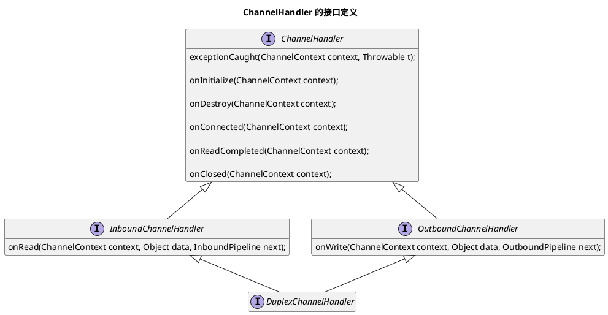
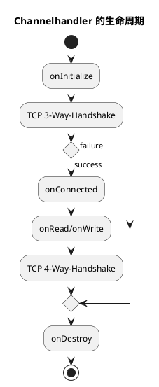
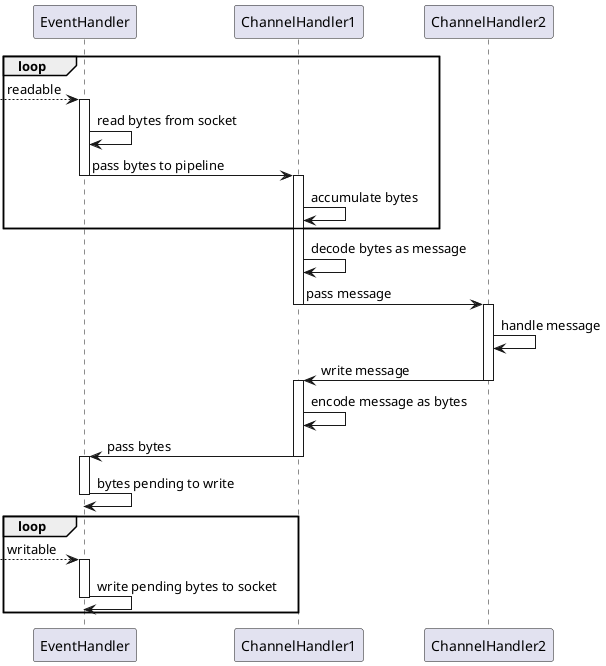
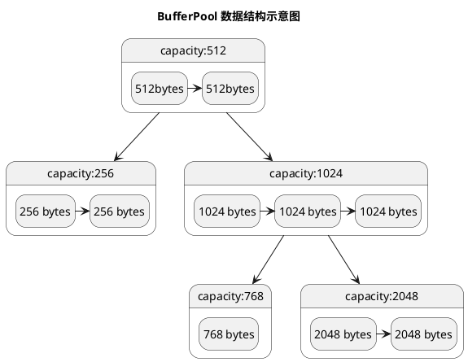

- 整体流程(基于流程图介绍)
- event loop 设计
  - 线程池改造
    - lock free技巧,如 shutdown、execute
  - event loop group 负载均衡
  - listenable future task 异步化

- ChannelHandler 设计
  - 责任链、观察者、写缓冲队列
  - 生命周期
  - OutboundPipeline 中执行 write操作, 如何避免死循环问题.
- 缓存池设计
  - LRU
  - release 机制(读写锁解决并发问题)
- RingBuffer
- 边界情况处理
  - 连接关闭,半开连接(一方关闭)

---

<p align="center">
    
</p>

## 整体架构

Lighty 基于 Multiple Reactors 模式实现, 其设计思想受启发于 Doug Lea 的 [Scalable I/O in Java](https://gee.cs.oswego.edu/dl/cpjslides/nio.pdf). 一个 Reactor 对应 Lighty 中的一个 `EventLoop`, 多个 `EventLoop` 组成一个 `EventLoopGroup`. `Acceptor` 负责处理 `acceptable` 事件, 将新到来的连接按一定负载均衡策略分配给 `EventLoopGroup` 中的一个.

```txt
                                                           EventLoop Group
                                                          ┌───────────────┐
                                                          │               │
                                                          │  EventLoop1   │
                                                          │               │
                                                          │  EventLoop2   │
new connection   ┌────────────────────┐   load-balance    │               │
────────────►    │ Acceptor EventLoop │   ───────────►    │  ...          │
                 └────────────────────┘                   │               │
                                                          │  EventLoopN-1 │
                                                          │               │
                                                          │  EventLoopN   │
                                                          │               │
                                                          └───────────────┘
```

连接被分配给 `EventLoop` 后, I/O 事件由 `EventHandler` 处理. 对于输入性事件(如 `readable` ), socket receive buffer 的数据被读出后, 会转交给用户的 `InboundPipeline` 中的 `ChannelHandler` 处理 ; 而对于输出性事件(`writeable`), 用户代码调用 `write`,`flush` 写入后, 数据会经过 `OutboundPipeline` 最后聚集到 `EventHandler` 所维护的 `OutputBuffer` , 在之后某个时刻发生的 `writable` 事件中将这些数据实际写入 socket send buffer.

```txt
EventLoop                    EventHandler                                    inbound pipeline(A set of ChannelHandler s

┌────────────┐              ┌────────────┐              ┌─────────────────────────────────────────────────────────────┐
│            │   readable   │┌─────────┐ │  input data  │ ┌──────────┬──────────┬─────────┬─────────────┬───────────┐ │
│            │   ────────►  ││in buffer│ │   ───────►   │ │ handler1 │ handler2 │  。。。  │ handlerN-1  │  handlerN │ │
│            │              │└─────────┘ │              │ └──────────┴──────────┴─────────┴─────────────┴───────────┘ │
│            │              │            │              └─────────────────────────────────────────────────────────────┘
│            │              │            │
│            │              │ event      │                                           │
│ event loop │              │ hanlder    │                                           │ write
│            │              │            │                                           ▼
│            │              │            │              ┌─────────────────────────────────────────────────────────────┐
│            │  writeable   │┌──────────┐│ output data  │ ┌──────────┬────────────┬─────────┬───────────┬───────────┐ │
│            │  ◄────────   ││out buffer││   ◄───────   │ │ handlerM │ handlerM-1 │  。。。  │ handler2  │  handler1 │ │
│            │              │└──────────┘│              │ └──────────┴────────────┴─────────┴───────────┴───────────┘ │
└────────────┘              └────────────┘              └─────────────────────────────────────────────────────────────┘

                                                                            outbound pipeline(A set of ChannelHandlers)
```

## ChannelHandler



- onInitialize, `ChannelHandler` 实例初始化后触发
- onConnected, 成功建立连接后触发(3-way-handshake 成功)
- onRead/onWrite, 数据输入/输出时触发
- onClosed, 挥手完成(4-way-handshake), 或强制中断连接(RST)时 触发
- onDestroy,`ChannelHandler` 被销毁时执行
- exceptionCaught, 异常捕获, 生命周期方法出现异常时执行



## Pipeline

应用层所需要做的事可抽象为 5 个步骤:

```txt
 read ──► decode ──► compute ──► encode ──► write
```

在 Lighty 中, 使用 `pipeline` 作为这一过程的抽象. `pipeline` 由若干个 `Channelhandler` 组成, 每个 `Channelhandler` 负责处理来自上游的“状态”, 并决定是否传递处理结果到下游.

下图展示一个包含 2 个 `ChannelHandler` 的 pipeline, 接受输入, 返回输出 的交互过程.

- `EventHandler` 从 socket 中读出数据, 传递给 `ChannelHandler1`
- `ChannelHandler1` 积聚足够的字节后, decode 出应用层报文, 并传递给 `ChannelHandler2`
- `ChannelHandler2` 接收到报文后, 执行 compute 动作, 然后输出(写入)结果
- `ChannelHandler1` 将输出结果编码后, 传递给 `EventHandler`



## 线程模型

每个 EventLoop 都是线程封闭(thread confinement)的, 同一个 Channel 的 `EventHandler` 自始自终都由同一个 EventLoop 线程执行. 而对于用户代码, `InboundPipeline`、`OutboundPipeline`, 既可以选择在 EventLoop 线程中执行, 也可以选择在单独的线程池中执行, 无论用户选择哪一种, Lighty 都可以保证 **pipeline 中的任意一个 `ChannelHandler` 自始自终都只在同一个线程中执行**, 不会发生 `ChannelHandler` 每次使用线程池中的不同 worker 线程执行的情况.(采用了一些比较 trick 的技巧, 受启发于 Netty) 因此用户不需要担心 `ChannelHandler` 中的全局可变变量的可见性、安全发布、竞争条件等问题, 换言之, `ChannelHandler` 也是线程封闭的.

下图展示了 Lighty 中的核心组件, `EventLoop`,`EventHandler`,`ChannelHandler` 的的执行线程, 其中 `ChannelHandler` 的执行线程是用户可配置的.

情况1, 如下图, pipeline 中所有 `ChannelHandler` 都运行在 event-loop 线程中


```txt
                               run in an event-loop thread
   ┌─────────────────────────────────────────────────────────────────────────────────────┐
   │ ┌───────────┐   ┌─────────────┐   ┌────────────────┐            ┌────────────────┐  │
   │ │ EventLoop ├──►│EventHandler │──►│ChannelHandler1 ├──►。。。 ──►│ChannelHandlerN │  │
   │ └───────────┘   └─────────────┘   └────────────────┘            └────────────────┘  │
   └─────────────────────────────────────────────────────────────────────────────────────┘
```

情况2,如下图, pipeline 中的所有 `ChannelHandler` 运行在一个独立的线程中

```txt
            run in an event-loop thread                  run in a pipeline thread
   ┌──────────────────────────────────┐     ┌─────────────────────────────────────────────────────┐
   │ ┌───────────┐    ┌─────────────┐ │     │ ┌────────────────┐              ┌────────────────┐  │
   │ │ EventLoop ├───►│EventHandler │ ├────►│ │ChannelHandler1 ├───►。。。 ───►│ChannelHandlerN │  │
   │ └───────────┘    └─────────────┘ │     │ └────────────────┘              └────────────────┘  │
   └──────────────────────────────────┘     └─────────────────────────────────────────────────────┘
```

情况3,如下图, pipeline 中的 `ChannelHandler` 分别运行在特定的线程中

```txt
      run in an event loop thread            run in thread-0   run in ...   run in thread-N
   ┌──────────────────────────────────┐     
   │ ┌───────────┐    ┌─────────────┐ │     ┌────────────────┐              ┌────────────────┐  
   │ │ EventLoop ├───►│EventHandler │ ├────►│ChannelHandler1 ├───►。。。 ───►│ChannelHandlerN │  
   │ └───────────┘    └─────────────┘ │     └────────────────┘              └────────────────┘  
   └──────────────────────────────────┘     
```

以上 3 种情况, 在 Lighty 中都可以轻松实现. 如下代码展示了如何配置不同 handler 使用不同线程:

```java
SingleThreadExecutorGroup handlerExecutorGroup = new SingleThreadExecutorGroup(2)

new ChannelInitializer<>() {
/**
 * 配置 pipeline 中的 handler 以及执行线程
 */
 @Override
 public void initChannel(InitializingNioSocketChannel channel) {
  channel.pipeline().add(handler1); //未显式指定线程池, handler1 将运行在 event-loop 线程
  channel.pipeline().add(handlerExecutorGroup, handler2); // handler2 将运行在单独的线程
 }
}
```

## 异步化

在 Lighty 中, 一切可能阻塞的动作都是异步的

- write
- connect
- bind
- close\shutdownInput\shutdownOutput

## RingBuffer

Java 中的 `ByteBuffer` 只有单指针, 每次写后读, 或读后写, 都需要 `flip`, 在跨上下文传递时使用, 这将会是一个灾难. 使用 `ByteBuffer` 的上下文, 上游是否已经 flip, 需要在代码中引入 “隐式的约定”.

Lighty 采用双指针的 `RingBuffer`, 解决了这一痛点.

```txt
    readPosition 		writePosition   
          │              │
  ┌───────▼──────────────▼──────────┐
  │ free  │  unread      │   free		│
  └───────┴──────────────┴──────────┘
```

## 缓冲区复用

***动机***

在 NIO 框架层面, 每次 readable 事件到来, 都需要申请一块内存(`ByteBuffer`), 用于装载 Socket 中的就绪数据, 然后传给用户的 `ChannelHandler`. 这是一个非常频繁的动作, 如果每次都申请新的内存, 将在内核层面带来大量内存分配/回收开销, 在 JVM 层面产生频繁地 GC 开销.

- 如果使用堆外内存, 需要频繁地 `malloc/free`, 带来内存分配算法的开销, 以及更容易产生外部碎片(因为是高频地小段地申请内存).
- 如果使用映射内存, 需要频繁地 `mmap/munmap`, 带来 VMA 和页表的维护成本, 由于映射空间只是短暂使用就释放, TLB 的利用率降低.
- 如果使用 GC heap 内存, 那么内核层面的分配、释放开销较小(因为 JVM 可以批量向 OS 申请内存), 但是会频繁地生成 `byte[]` 对象, 增加 GC 开销.

**解决方案**

缓冲池需要对外提供两种操作:

```java
/**
 * 申请内存
 */
ByteBuffer take(int capacty);

/**
 * 回收内存
 */
void put(ByteBuffer);
```

可采用 Map 数据结构来作为“池子”, put 时将内存放入 Map, take 时从优先 Map 中取, 未取到则创建新的.

这里有一点需要注意, 假如池子里现存一个 capacity 为 6 的 `ByteBuffer`, 现需申请一个 capacity 为 5 的 ByteBuffer, 则应当复用现有的. 实现这一点, 我们需要一个支持排序, 可范围查找的数据结构, 可能的选择是: 平衡树 或 跳表. Lighty 中选择了平衡树(TreeMap).

> 在并发控制上, 跳表这种数据结构更适合以 lock-free 的方式实现, 这也是为什么 Java 有 ConcurrentSkipList 而未曾有 ConcurrentTreeMap 的原因. 但是由于 缓存池 的实现并不只依靠单个数据结构, 还需组合 LRU 的数据结构, 采用并发跳表的话, 需要考虑整体上 lock-free 的可行性, 计划在发布 1.0 之前深入调研和验证一下这个问题.

如下图, 树的每个节点代表一种“容量”, 使用一个链表存储容量为该值的 `ByteBuffer`, 当需要某种容量的 `ByteBuffer` 时, 比如要申请容量为 700 bytes 的 `ByteBuffer`, 那么从树中查找 >=700 bytes 的最小节点, 下图的例子中, 容量为 768 的节点会被命中, 最终从该节点的链表中取出 `ByteBuffer` 复用.



除此之外, 缓存池是有界的, 因此需要实现淘汰机制, 保留更常用的 `ByteBuffer`, 丢弃不常用的. “更常用”的可以有很多种解释, 比如 LRU 优先保留“最近使用”的, LFU 优先保留“使用总次数最多+最近使用”, LRU Letty 中选择了 LRU.

## 零拷贝(放到最佳实践文档中)

在 Lighty 中, 可以轻松实现“文件分发场景”的零拷贝, 直接传入已经 open 的文件句柄即可.

```java
class FileSender extends ChannelHandlerAdapter {

    @Override
    public void onConnected(ChannelContext context) {
        //1. open 文件
        FileChannel fileChannel = FileChannel.open("path/to/file", StandardOpenOption.READ);
    		//2. 将文件写入
        context.channel()
                .write(fileChannel)
								//3. 监听写入结果
                .addListener(future -> {
                  	log.info("File send result: {}",future.isSuccess());
                });
    }
}
```
