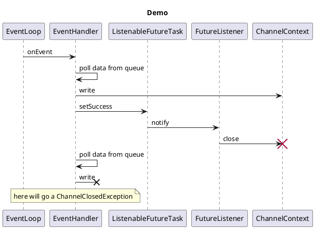
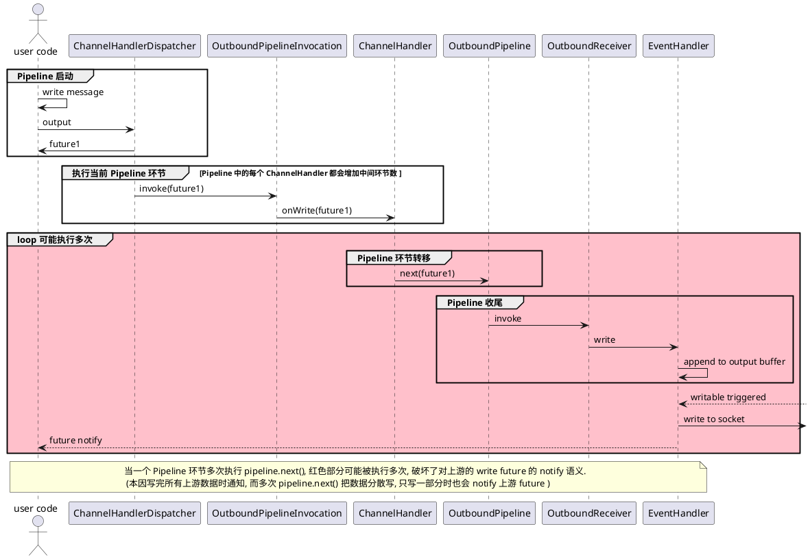

# 历史问题汇总

[TOC]

## 空轮询问题

无意义的 interest 应及时从 interest set 中移除, 比如 对于一个 `SocketChannel` 而言 connectable
事件发生一次后就不会再发生了,应 `key.interestOps() ^ SelectionKey.OP_CONNECT` 移除掉, 否则会导致 `selector.select()`
无限返回 0.

## Pipeline 线程封闭问题

对于一个 channel 的读写、编码解码、报文处理,每一个阶段都可以指定不同的 `Executor` 执行, 但是对于每一个阶段,每次执行,执行线程应该总是不变. 这样可以避免线程安全问题.

## 预防用户代码意外关闭 channel

如下图, 在写数据到 socket send buffer 的过程中, 每写一个都会触发一次对用户代码的通知, 如果用户代码中将 channel close, 那么会导致 `OutputBuffer` 中的其他数据写入一个已关闭的 channel, 导致异常.
解决这一问题,  因此 `ChannelContext.close()` 内部, 应该在下一个事件循环去关闭底层 channel, 而不是当前. 



## OutboundPipeline write操作 死循环问题

见 ChannelContext#nextContext

## OutboundPipeline 分散时 Future 通知问题

对于上游的一次 `write` 操作, 可能会被中间环节分散为多次“转移”, 这种情况, 对上游 `write` 操作产生的 `Future` 的 `notify` 操作, 便产生了语义矛盾的问题.

对于上游而言, 其本来应该时希望在 “全部写完” 的时机再被 `notify`, 而现在未写完也会触发 `Future`.

问题的原因在于 Lighty 无法知道 Pipeline 中的一个环节 何时把上游传递的数据写完了, 因此做不到自动 `notify`, 这个控制权只能交给用户.



## TCP 连接关闭问题

```txt
           time                     time
            │                        │
         ┌──┼─────────FIN───────────►│
         │  │                        │
  FIN_WAIT1 │                        │
         │  │                        │
         ├──┤◄─────────ACK───────────┼──┐
         │  │                        │  │
         │  │                        │  │
         │  │                        │  │
  FIN_WAIT2 │◄─────────FIN───────────┤ Close Wait
         │  │                        │  │
         │  │                        │  │
         │  │                        │  │
         └──┼──────────ACK──────────►├──┘
            │                        │
            ▼                        ▼
```

> Mac 中可通过 `sysctl net.inet.tcp | grep  fin_timeout` 查看 FIN 超时时间

shutdownInput

- 己方的后续 read 返回 -1, 多路复用模式下会收到 readable 事件(如果 `OP_READ` 在 interest set 中).
- 对方发出的数据会收到 RST 响应

shutdownOutput

- 己方会发出 FIN 包, 而接收方 read 将返回 -1

> 如果一方先 shutdownOutput 后 write, 将得到:  java.nio.channels.AsynchronousCloseException: null

close 与 shutdownOutput

- 两者都会发出 `FIN` 包, 但是 `close` 会直接释放资源(MAC 下 `lsof -i tcp:端口` 直接消失), 在等待一段时间(取决于系统设置,本人机器为 60s) 后直接一个 `RST`.
- 而 `shutdownOutput` 后连接处于 `FIN_WAIT2` 状态, 会等待无限长的时间,这种连接也被称为半开连接, 因为只关闭了输出方向,
  而接收方向仍然可以接收数据(对端还能继续发).

总结: `close` 是最后通牒式的关闭, 而 `shutdownOutput` 是无限等待式关闭.

Selector

- 水平触发,事件不处理,每次 select 都会返回
- 关闭 channel , 对应的 selectionKey 也会 invalid , 相当于自动 cancel

### SocketChannel 的关闭处理

关闭一个 TCP 连接有两种方式

1. 协商式,双方先后 `shutdownOutput`,完成 “four-way handshake”; 单方 `shutdownOutput` 只表示不发出数据,但仍然可以接收数据.
2. 强迫式,主动 `close` 的一方发出 FIN 包后, 此时既不能发出数据,也不再接收数据(收到会返回 RST 警告), 只会形式化走个过场,等待对方的
   FIN,若超时便强行断开连接.

如果使用第二种来关闭, 那么对于主动的一方, `channel.close` 内部会自动释放资源,包括将 `SelectionKey` 变为 invalid, 使之在下一次
select 时, 被检测到继而从 `Selector` 中移除. 而对于被强迫的一方,后续对 channel
的操作会发生异常 `java.net.SocketException: Connection reset`, 通过捕获异常, 进行 `key.cancel`, `channel.close` 即可.

而如果使用第一种来关闭,那么就需要慎重处理.

具体来讲, 双方先后 shutdownOutput, 此时连接**事实上**已经关闭(TCP层面), 但是 java
层面 `key.isValid()`,`channel.isConnected`,`channel.isOpen` 均为 true. 而且`Selector` 的 key set
会存在“僵尸” `SelectionKey`.

为了避免资源泄漏,

- 每一方在收到对方`FIN` 以后, 都需要检查己方是否发出了 `FIN`
- 每一方在发出 `FIN` 时,都需要检查是否收到了对方的 `FIN`

当检查到双方都发出了`FIN`时,则应该释放资源.

### ServerSocketChannel 的关闭处理

在服务端, `SocketChannel` 都是由 `ServerSocketChannel#accept` 返回, 一个问题是, 当关闭 ServerSocketChannel 时,
相关联的 `SocketChannel` 是否还有效?

问题的答案是, 仍然有效, 这些 channel 可以正常读写数据. `ServerSocketChannel` 被关闭后, 会关掉监听端口的能力, 因此无法接收新的连接.

### 半开连接

netty 中, 如果一方调用 ctx.close() , 那么这一方的写缓冲区中的待写数据将丢弃 `AbstractUnsafe#close:735`.
而当另一方 read() 返回 -1 时, 会根据配置 `isAllowHalfClosure` 决定是否关闭 socket, 当选择关闭时
写缓冲区中的数据会被丢弃 `NioByteUnsafe#closeOnRead:101`

> 被丢弃的数据对应的 future 回调会返回异常 StacklessClosedChannelExceptionΩ

## EventLoop shutdown 问题

通常会在循环中 `Selector.select()` 等待事件, 然后循环处理, 我们称之为事件循环. 一个最简单的时间循环危代码如下:

```java
class EventLoop {
    Selector selector = Selector.open();

    void run() {
        while (!Thread.currentThread().isInterrupted()) {
            selector.select();
            for (var key : selector.selectKeys()) {
                handlerEvent(key);
            }
        }
    }
}
```

一个单线程的 Server 由一个 EventLoop 构成, 随着时间的推移,当连接建立时,都会 register 一个 channel 到 selector; 当连接关闭时,由从
selector 中 cancel.

那么,如果希望关掉 Server, 那么应该如何释放资源呢?

`selector.close()` 仅仅只会让 `SelectionKey` 失效, 并 deregister channel , 这些 channel 并没有关闭.

> Any uncancelled keys still associated with this selector are invalidated,
> their channels are deregistered,
> and any other resources associated with this selector are released.

没有人希望关闭 Server 时, 连接居然还未释放.

一种简单粗暴的释放方式如下,这一种强迫式关闭连接的方式.

```java
for(SelectionKey selectionKey:selector.keys()){
        try{
        selectionKey.channel().close();
        }catch(Throwable th){
        }
        }
        selector.close();
```

### Netty shutdownGracefully 源码

当调用 `shutdownGracefully` 时, 内部会更改 EventLoop 线程的状态为关闭ing状态 `ST_SHUTTING_DOWN`, 然后 `wakeUp` 该线程.

处于关闭ing状态的事件循环(`NioEventLoop`)将不再接受新的任务,
EventLoop 线程被唤醒(如果阻塞与 select 的话)后, 先执行`NioEventLoop#runAllTasks`消费完任务队列, 然后检测当前状态,
当判定为处于关闭状态(`ST_SHUTTING_DOWN`) 时, 会执行 `NioEventLoop#closeAll`, 该方法会将 selector 关联的所有 channel 关闭,
并释放相关资源, 比如:

- OutboundBuffer 中尚未写完的数据将被取消
- channel 的 closed 事件被执行
- selectionKey 被 cancel
- pipeline 的 `fireChannelInactive` 被执行.

## 异常捕获

### Netty 中的异常捕获

对于 `GenericFutureListener`, 如果执行回调时, 用户代码出现异常, Netty 只会打印一行 warn 级别的堆栈.
> DefaultPromise#notifyListener0

对于 `ChannelHandler` 的各个生命周期方法, 都会执行在 try/catch 中, 当某个 `ChannelHandler` 发生异常时, 将异常转给这个
handler 的 `exceptionCaught` .

当 `exceptionCaught` 的执行也产生异常时, 那么打印一行 warn 日志.

> `AbstractChannelHandlerContext#invokeExceptionCaught`

如果用户的 `ChannelHandler`, 没有重写 `exceptionCaught` 的话, 那么 `ChannelInboundHandlerAdapter`
的默认实现是传递给下一个(`ctx.fireExceptionCaught(cause);`), 最终传递给默认的异常处理
handler (`DefaultChannelPipeline`), 其实现是打印一行 warn 日志(`DefaultChannelPipeline#onUnhandledInboundException`).

## 连接超时机制实现

```plantuml
!include Timeout-ConnectTimeout.puml
```

## 读超时机制实现

```plantuml
!include Timeout-ReadTimeout.puml
```

### 问题

**问题 1**, 如何关联请求与响应? 即每当收到一个响应如何知道其对应哪一个请求?

在同一个连接上发出的多次请求, 一定是先发出的请求先收到响应的, 只需要预先在发出请求时就维护请求顺序, 那么在收到响应时就可以对应起来.

```plantuml
!include Timeout-ReadTimeout-RequestResponseMapping.puml
```

**问题 2**, 如何处理“姗姗来迟”的响应?

可以维护一个计数值 `timeoutCount`, 当延迟任务里检测到响应超时, 那么就意味着接下来会有一个响应一定是 ”姗姗来迟“ 的(或者一直不来), 这时 `timeoutCount += 1`, 当之后的某个时间点(也可以是无期限)这个响应来了, 那么丢弃掉.


```plantuml
!include Timeout-ReadTimeout-TimeoutResponse.puml
```

### 实现方案

`ReadTimeoutHandler` 维护两种数据结构+1个计数器:

1. “写操作” 的 FIFO 队列
2. “写操作-响应状态”的映射关系
3. timeoutNumber 当前超时消息计数

每当发生写操作时, 将“写操作” 加入 FIFO 队列, 并记录状态为 “not replied”
并向 EventLoop 投入延迟任务

每当发生可读事件时,

- 如果 timeoutNumber == 0, 那么 dequeue 一个写操作, 并更新状态为 “replied”
- 如果 timeoutNumber >0, 那么说明当前这个消息是一个“迟到”的消息,应当丢弃,  

每当延迟任务触发时,检查写操作状态 (延迟任务与写操作一对一)

- 如果 “replied”, 则一切正常
- 如果 “not replied”, 则传递超时异常给上游(输出向管道的上游), 同时 timeoutNumber+=1, 表示要丢弃下一个到来的消息

```js
class ReadTimeoutHandler{

    map = new HashMap()
    queue = new Queue()
    timeoutCount = 0

    public void onWrite( data, pipeline){
            requestId = count++ 
            queue.enqueue(requestId)
            map.put(requestId, notReplied)
            
            pipeline.next(data)
                    .addListener(){
                            getCurrentEventLoop().execute( 5000 milliseconds, ()->{
                                    // 如果超时仍未收到回复
                                    status = map.get(requestId)
                                    if(status==notReplied){
                                            pipeline.upstream.exceptionCaught(new ReadTimeoutException())
                                            timeoutCount +=1
                                    }
                            })
                    }
        
    }

    public void onRead(data, pipeline){
            requestId = queue.dequeue()
            if(timeoutCount>0){
                    //丢弃“迟到”的消息
                    map.remove(requestId)
                    timeoutCount -= 1
            }else{
                    map.put(requestId, replied) //更新消息状态
                    pipeline.next(data)
            }
    }
}
```


<!-- 问题: 如果一个写请求, 响应超时, 那么如何处理写请求队列, 如何应对后续 超时的响应 的到来 -->


