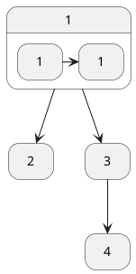

- 整体流程(基于流程图介绍)
- event loop 设计
    - 线程池改造
        - lock free技巧,如 shutdown、execute
    - event loop group 负载均衡
    - listenable future task 异步化
- 缓存池设计
    - LRU
    - RingBuffer
    - release 机制(读写锁解决并发问题)
- ChannelHandler 设计(责任链、观察者、写缓冲队列)
    - OutboundPipeline 中执行 write操作, 如何避免死循环问题.
- 边界情况处理
    - 连接关闭,半开连接(一方关闭)

---

## 缓冲池设计

动机:

在 NIO 框架层面, 每次 readable 事件到来, 都需要申请一块内存(`ByteBuffer`), 从 Socket 中的数据拷贝这块内存, 然后传给用户
Handler. 这是一个非常频繁的动作, 如果每次都申请新的内存, 将在内核层面带来大量内存分配/回收开销(
对于堆外内存、映射内存则更为明显),以及 JVM 层面成频繁的 GC.

目标:

实现缓冲池, 进而达成内存复用机制目的.

需求分析及方案:

缓冲池需要对外提供两种操作:

```java
/**
 * 申请内存
 */
ByteBuffer take(int capacty);

/**
 * 回收内存
 */
void put(ByteBuffer);
```

可采用 Map 数据结构来作为“池子”, put 时将内存放入 Map, take 时从优先 Map 中取, 未取到则新建.

这里有一点需要注意, 假如池子里现存一个 capacity 为 6 的 ByteBuffer, 现需申请一个 capacity 为 5 的 ByteBuffer, 则应当复用现有的.
于是我们需要支持排序, 范围查找的数据结构, 可能的选择是: 平衡树 或 跳表. Letty 中选择了平衡树(TreeMap).

> 在并发控制上, 跳表这种数据结构更适合以 lock-free 的方式实现, 这也是为什么 Java 有 ConcurrentSkipList 而未曾有
> ConcurrentTreeMap 的原因. 但是由于 缓存池 的实现并不只依靠单个数据结构, 还需组合 LRU 的数据结构, 采用并发跳表的话, 需要考虑
> lock-free 的可行性、以及设计方案、编码, 这将需要很多时间, 因为设计并发代码常常需要站在汇编的层面去思考.

除此之外, 缓存池是有界的, 因此需要实现淘汰机制, 保留更常用的内存, 丢弃不常用的. “更常用”的可以有很多中解释, 比如 LRU
优先保留“最近使用”的 ,LFU 优先保留“使用总次数最多+最近使用”,
LRU Letty 中选择了 LRU.



## 并发问题

### Channel shutdown 操作

#### 动机

当一个 socket 的输入端、输出端均被关闭时(通过 `shutdownInput/shutdownOutput`), 其对应 `SelectionKey`
仍旧存在于 `Selector` 的 key set中, 并且 channel 会处于不一致状态(isConnected、sOpen 均为 true) , 等一些释放资源操作无法被执行.
这是不可容忍的, 需要一种机制探测 input/output 都关闭的情况.

#### 解决方案

逻辑上,解决这个问题并不难, 只需要

- 在发现 socket input 被关时检查一下 output 是否被关
- 在发现 socket output 被关时检查一下 input 是否被关
  以上两种情况,任意一种条件为 true 则意味 socket 已经关闭, 可以回收资源, 伪代码实现如下:

```kotlin
var shutdownInput = false
var shutdownOutput = false

fun shutdownInput() {
    shutdownInput = true
    if (shutdownOutput == true) {
        releaseResource();
    }
}

fun shutdownOutput() {
    shutdownOutput = true
    if (shutdownInput == true) {
        releaseResource()
    }
}
```

代码很简单, 在单线程环境, 是可以正确工作的.

那么在并环境下, 执行结果能正确吗? 如果不正确, 应采取什么样的同步方案? 如何避免“过度同步”?

这是我们在本节要探讨的问题. 我们将前述代码表示为下图:


由于变量 `shutdownInput`,`shutdownOutput` 的读写处于 "Relaxed Mode", 两个线程的操作1 和 操作2 之间并没依赖关系, 重排是允许的.

> 这里所说的 “Relaxed Mode” 对应于 JEP188 Java Memory Model 中的 “Plain Mode”. ( C++11 的 `memory_order_relaxed`)
>
> 引用 Doug Lea 在 《Using JDK 9 Memory Order Modes》中的段落:
> - 编译器重排:
    > Compilers are allowed to make some different choices when mapping the original tree-like (and parallelizable)
    expression into a sequential instruction stream.
>
> - 处理器重排:
    > Such decisions by compilers about instruction order might not matter much, because commodity processors themselves
    perform parallel ("out-of-order") instruction execution.

也即是, 肯能发生如下执行时序:


1. 线程A 和 线程B 在同一时刻,分别读取 shutdownOutput、shutdownInput, 此时结果都为 false
2. 线程A 和 线程B 分别更新 shutdownOutput、shutdownInput 的值为 true
3. 由于第一步中, 读到的值为 false, 线程A 和 线程B都不会执行 `releaseResource`

至此, 问题已经很明确, 我们要做的就是阻止重排.

熟悉 [JSR133](https://www.cs.umd.edu/~pugh/java/memoryModel/jsr133.pdf) 的人应该会想到利用 volatile 的内存语义, 其具体依据是
《JSR-133: JavaTM Memory Model and Thread Specification》 中的如下条款:

> The semantics of volatile variables have been strengthened to have acquire and release semantics. In the original
> specification, accesses to volatile and non-volatile variables could be freely ordered.

如果给

```java
boolean outputFin;
boolean inputFin;

public void shutdownInput() {
  inputFin = true; //写操作
  if (outputFin) { //读操作
    releaseResource();
  }
}

public void shutdownOutput() {
  outputFin = true;   //写操作
  if (inputFin) {     //读操作
    releaseResource();
  }
}
```


## 2

```java


```

```txt
Thread1            | Thread2
---------------------------------------
shudownOutput=true | write  
clearOutputBuffer  | if shudownOutput!=true
                   | then append OutputBuffer
 

```